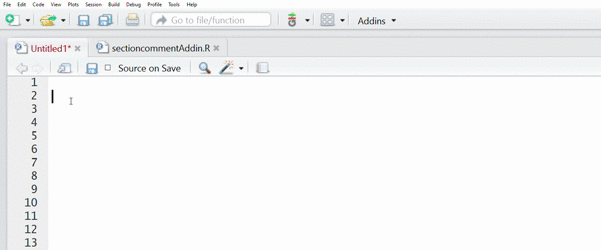
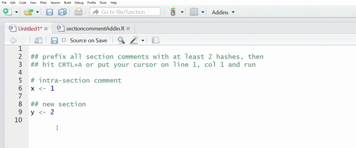

# sectioncomment

Creates an 80 character width comment right-padded with hyphens, similar to how 
comments are recommended in Hadley's style guide (http://adv-r.had.co.nz/Style.html) which 
recommends: "Use commented lines of - and = to break up your file into easily readable chunks."

```r
# Load data ---------------------------
# Plot data ---------------------------
```

The additional benefit is that comments formatted in this manner appear in the selection box 
at the bottom left of the Source Pane for easier navigation.


## System Requirements

* Run RStudio v0.99.878 or later
  - <https://www.rstudio.com/products/rstudio/download/preview/>
* Run `rstudioapi` package v0.5 or later
  - `install.packages("rstudioapi", type = "source")`
* Populate your *Addins* dropdown menus with some examples
  - `devtools::install_github("rstudio/addinexamples", type = "source")`

## Installation

```r
devtools::install_github("ReportMort/sectioncomment")
```

## Usage

#### Change Existing Commment to Section Comment

Useful to convert your existing comments into sections 
in order to help with code readability



#### Create a New Comment as a Section Comment

Useful when you just want to add placeholder section
comments to come back and fill in later


#### Select Text and Convert all Comments to Section Comments

If you select a multiple lines of text then all comments 
within the selection will be converted to section comments 
after clicking Addins > Section Comment


#### Scan Entire Document for Comments to Convert 

If you put the cursor at line 1, col1 or hit CTRL+A before 
clicking Addins > Section Comment, then all comments prefixed 
with 2 or more hashes will be converted to Section Comments


